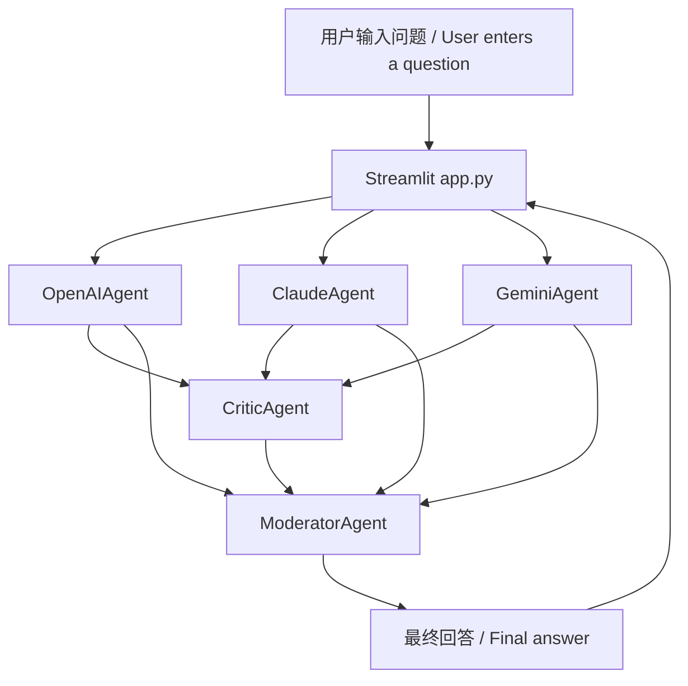

# 架构 / Architecture

这个项目刻意保持小而清晰。应用主要分为三层：

This project is intentionally small and clear. The app has three main layers:

1. `app.py` 中的 Streamlit UI。
   Streamlit UI in `app.py`.
2. `agents/` 中的 Agent 实现。
   Agent implementations in `agents/`.
3. `utils/config.py` 中的环境配置。
   Environment configuration in `utils/config.py`.

## 请求流程 / Request Flow

## Agent 职责 / Agent Responsibilities

- `OpenAIAgent`：严谨分析、隐含假设识别和第一版判断。
  `OpenAIAgent`: rigorous analysis, implicit assumptions, and first-pass judgment.
- `ClaudeAgent`：结构、可读性、风险提示和保守判断。
  `ClaudeAgent`: structure, readability, risk notes, and conservative judgment.
- `GeminiAgent`：替代路径和方案比较。
  `GeminiAgent`: alternative paths and option comparison.
- `CriticAgent`：批判 GPT、Claude 和 Gemini 的输出。
  `CriticAgent`: critique of GPT, Claude, and Gemini outputs.
- `ModeratorAgent`：最终综合和可执行建议。
  `ModeratorAgent`: final synthesis and actionable recommendations.

## 状态管理 / State Management

Streamlit 会在 UI 控件变化时重新运行应用。应用把最近一次完成的讨论存入 `st.session_state`，所以切换显示设置不会丢弃已有 Agent 输出，也不会再次触发模型调用。

Streamlit reruns the app whenever UI controls change. The app stores the last completed discussion in `st.session_state`, so toggling display settings does not discard previous agent output or trigger model calls again.

保存的值包括：

The saved values are:

- `discussion_question`
- `discussion_outputs`

## 外部服务 / External Services

应用可以调用三个外部服务商：

The app can call three external providers:

- 通过 `openai` SDK 调用 OpenAI。
  OpenAI through the `openai` SDK.
- 通过 `anthropic` SDK 调用 Anthropic。
  Anthropic through the `anthropic` SDK.
- 通过 `google-genai` SDK 调用 Google Gemini。
  Google Gemini through the `google-genai` SDK.

API Key 由 `utils/config.py` 从 `.env` 加载。缺少 Key 是允许的：每个 Agent 会返回清晰的缺失 Key 提示，而不是让整个应用崩溃。

API keys are loaded from `.env` by `utils/config.py`. Missing keys are allowed: each agent returns a clear missing-key message instead of crashing the whole app.

## 非目标 / Non-Goals

- 本项目不展示模型隐藏思维链；UI 只展示面向用户的摘要和讨论记录。
  This project does not expose model hidden chain-of-thought; the UI shows user-facing summaries and discussion records only.
- 本项目不会在本地环境之外代理或存储 API Key。
  This project does not proxy or store API keys outside the local environment.
- 本项目不提供生产级认证、限流、持久化或部署加固。
  This project does not provide production authentication, rate limiting, persistence, or deployment hardening.
