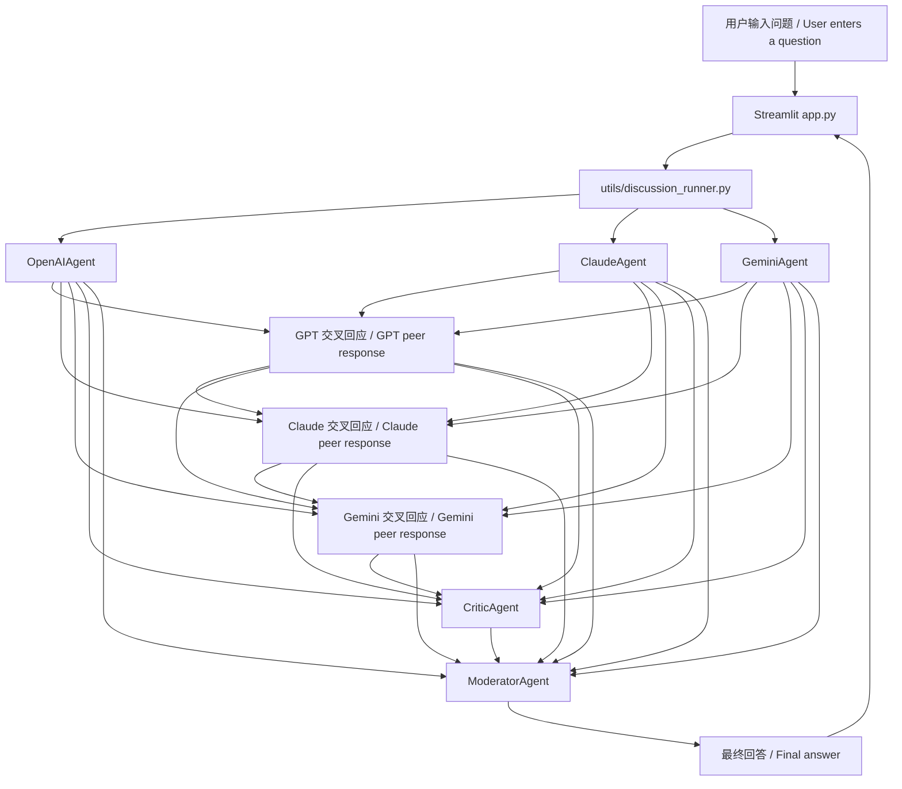

# 架构 / Architecture

这个项目刻意保持小而清晰。应用主要分为四层：

This project is intentionally small and clear. The app has four main layers:

1. `app.py` 中的 Streamlit UI。
   Streamlit UI in `app.py`.
2. `utils/discussion_runner.py` 中的讨论编排。
   Discussion orchestration in `utils/discussion_runner.py`.
3. `agents/` 中的 Agent 实现。
   Agent implementations in `agents/`.
4. `utils/config.py` 和其他 `utils/` 模块中的配置与纯函数 helper。
   Configuration and pure helper functions in `utils/config.py` and other `utils/` modules.

## 请求流程 / Request Flow

## Agent 职责 / Agent Responsibilities

- `OpenAIAgent`：严谨分析、隐含假设识别和第一版判断。
  `OpenAIAgent`: rigorous analysis, implicit assumptions, and first-pass judgment.
- `ClaudeAgent`：结构、可读性、风险提示和保守判断。
  `ClaudeAgent`: structure, readability, risk notes, and conservative judgment.
- `GeminiAgent`：替代路径和方案比较。
  `GeminiAgent`: alternative paths and option comparison.
- GPT、Claude 和 Gemini 在首轮观点之后会各自生成一轮交叉回应，用于回应彼此的观点和修正判断。
  After the first-pass views, GPT, Claude, and Gemini each generate one peer-response round to respond to each other and revise their judgments.
- `CriticAgent`：批判 GPT、Claude 和 Gemini 的输出。
  `CriticAgent`: critique of GPT, Claude, and Gemini outputs.
- `ModeratorAgent`：最终综合和可执行建议。
  `ModeratorAgent`: final synthesis and actionable recommendations.

## 状态管理 / State Management

Streamlit 会在 UI 控件变化时重新运行应用。应用把最近一次完成的讨论存入 `st.session_state`，所以切换显示设置不会丢弃已有 Agent 输出，也不会再次触发模型调用。

Streamlit reruns the app whenever UI controls change. The app stores the last completed discussion in `st.session_state`, so toggling display settings does not discard previous agent output or trigger model calls again.

保存的值包括：

The saved values are:

- `discussion_question`
- `discussion_outputs`
- `discussion_turns`

`discussion_turns` 保存同一窗口中的多轮问题和 Agent 输出。追问时，`utils/conversation.py` 会把最近几轮讨论转换为上下文提示词，再交给当前 Agent 流程。

`discussion_turns` stores multiple questions and agent outputs in the same window. For follow-up questions, `utils/conversation.py` converts recent turns into a contextual prompt before passing it into the current agent flow.

## 外部服务 / External Services

应用可以调用三个外部服务商：

The app can call three external providers:

- 通过 `openai` SDK 调用 OpenAI。
  OpenAI through the `openai` SDK.
- 通过 `anthropic` SDK 调用 Anthropic。
  Anthropic through the `anthropic` SDK.
- 通过 `google-genai` SDK 调用 Google Gemini。
  Google Gemini through the `google-genai` SDK.

API Key 由 `utils/config.py` 从 `.env` 加载。缺少 Key 是允许的：每个 Agent 会返回清晰的缺失 Key 提示，而不是让整个应用崩溃。

API keys are loaded from `.env` by `utils/config.py`. Missing keys are allowed: each agent returns a clear missing-key message instead of crashing the whole app.

如果 `DEMO_MODE=true`，Agent 会返回 `utils/demo.py` 中的本地模拟内容，不会调用外部服务。

If `DEMO_MODE=true`, agents return local deterministic sample responses from `utils/demo.py` and do not call external services.

`CriticAgent` 和 `ModeratorAgent` 默认使用 `auto` provider 选择：按 OpenAI、Anthropic、Gemini 的顺序选择已配置 API Key 的服务商，并在自动模式下尝试下一个可用服务商作为 fallback。也可以通过 `CRITIC_PROVIDER` 和 `MODERATOR_PROVIDER` 显式指定 `openai`、`anthropic` 或 `gemini`。

`CriticAgent` and `ModeratorAgent` default to `auto` provider selection: they try configured providers in OpenAI, Anthropic, Gemini order and fall back to the next available provider in automatic mode. `CRITIC_PROVIDER` and `MODERATOR_PROVIDER` can explicitly select `openai`, `anthropic`, or `gemini`.

## 导出 / Export

单轮讨论和整段对话都可以通过 `utils/export.py` 转换为 Markdown。Streamlit UI 使用同一个工具函数提供下载按钮，因此导出逻辑可以独立测试。

Single-turn discussions and full conversations can be converted to Markdown through `utils/export.py`. The Streamlit UI uses the same helper to provide download buttons, so export behavior can be tested independently.

## 非目标 / Non-Goals

- 本项目不展示模型隐藏思维链；UI 只展示面向用户的摘要和讨论记录。
  This project does not expose model hidden chain-of-thought; the UI shows user-facing summaries and discussion records only.
- 本项目不会在本地环境之外代理或存储 API Key。
  This project does not proxy or store API keys outside the local environment.
- 本项目不提供生产级认证、限流、持久化或部署加固。
  This project does not provide production authentication, rate limiting, persistence, or deployment hardening.
