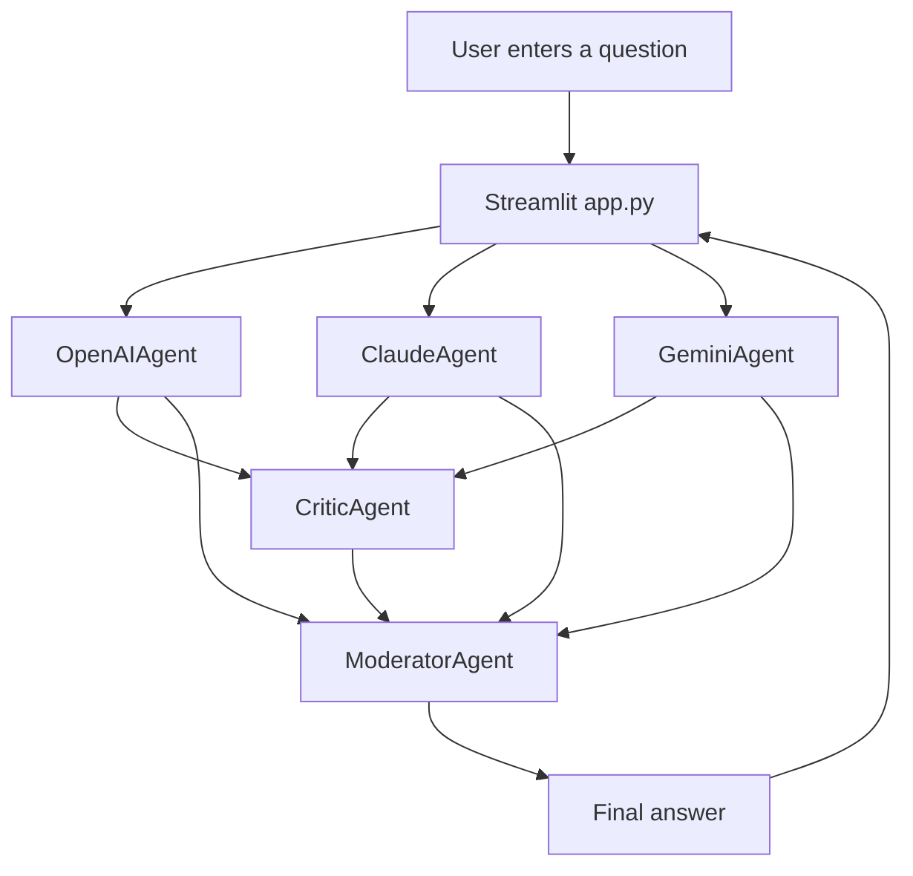

# Architecture

This project is intentionally small. The app has three main layers:

1. Streamlit UI in `app.py`
2. Agent implementations in `agents/`
3. Environment configuration in `utils/config.py`

## Request Flow

## Agent Responsibilities

- `OpenAIAgent`: rigorous analysis, implicit assumptions, first-pass judgment.
- `ClaudeAgent`: structure, readability, risk and conservative judgment.
- `GeminiAgent`: alternative paths and option comparison.
- `CriticAgent`: critique of GPT, Claude, and Gemini outputs.
- `ModeratorAgent`: final synthesis and actionable recommendations.

## State Management

Streamlit reruns the app whenever UI controls change. The app stores the last completed discussion in `st.session_state`, so toggling display settings does not discard previous Agent output or trigger model calls again.

The saved values are:

- `discussion_question`
- `discussion_outputs`

## External Services

The app can call three external providers:

- OpenAI through the `openai` SDK
- Anthropic through the `anthropic` SDK
- Google Gemini through the `google-genai` SDK

API keys are loaded from `.env` by `utils/config.py`. Missing keys are allowed. Each Agent returns a clear missing-key message instead of crashing the whole app.

## Non-Goals

- This project does not expose model hidden chain-of-thought. The UI shows user-facing summaries and discussion records only.
- This project does not proxy or store API keys outside the local environment.
- This project does not provide production authentication, rate limiting, persistence, or deployment hardening.
